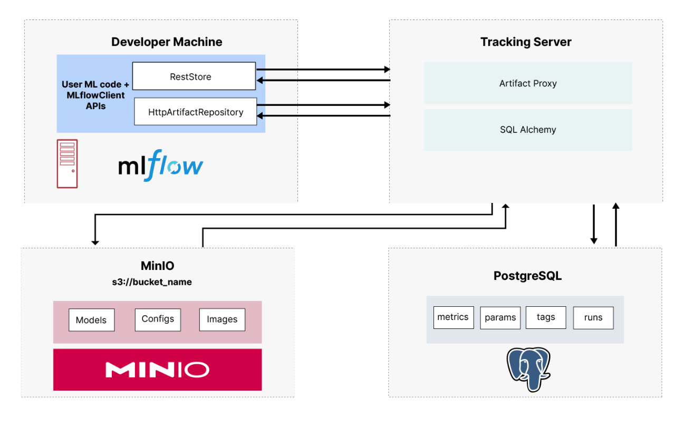

<h1>MLFLOW docker compose working sample </h1>

---


<b>The main idea is to create a docker compose with all the elements to have a working mlflow server using minio server for artifact storage and a postgresql database with docker volumes for data persistence.</b>




Steps

1. clone the repo
2. ./build_containers.sh
3. ./create_columens.sh
4. docker compose up -d

</br>
</br>

```

gh repo clone bygregonline/mlflow-docker-compose
cd mlflow-docker-compose
./build_containers.sh
./create_columens.sh
docker compose up -d


```

VOILA thats all you need to do

---

if you want to stop
docker compose down


---

**NO SE COMO HACER QUE FUNCIONE EN WINDOWS NI ME INTERESA INVESTIGARLO
